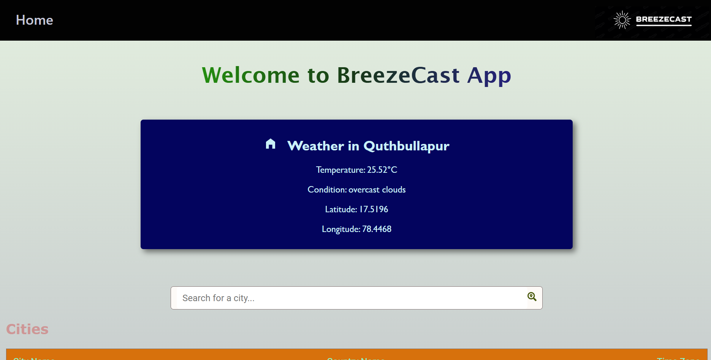
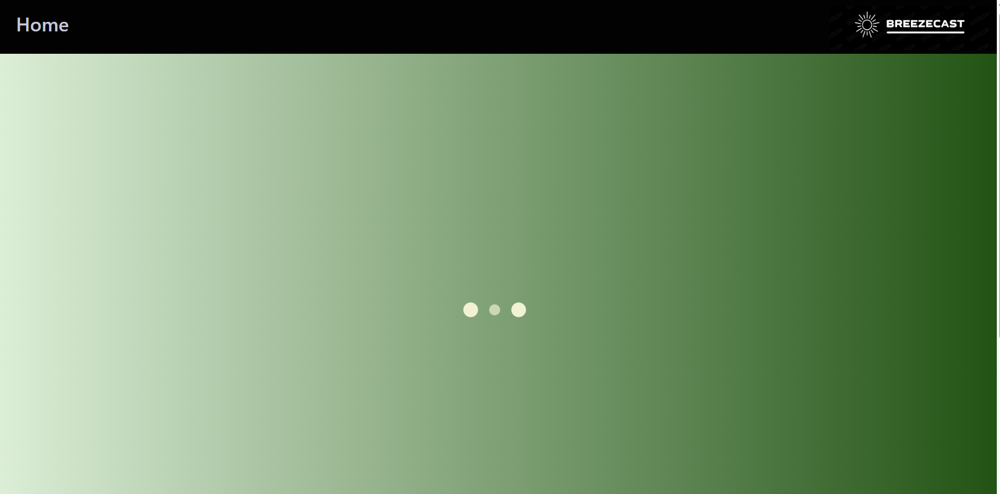
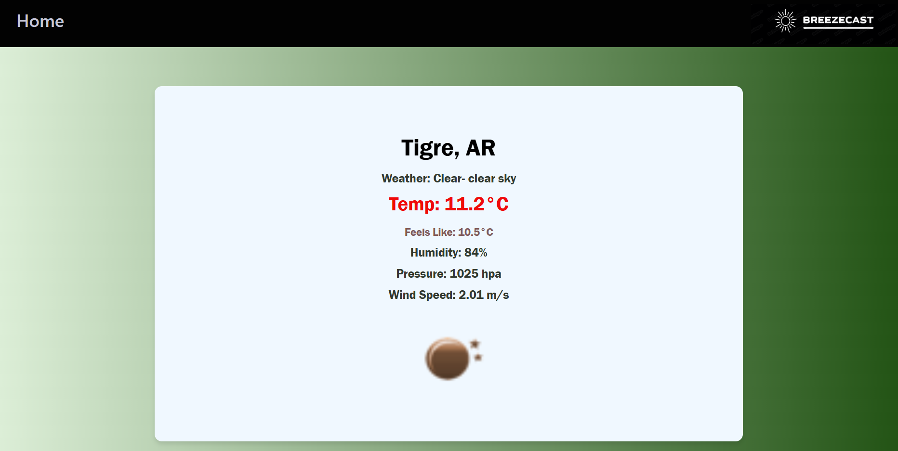
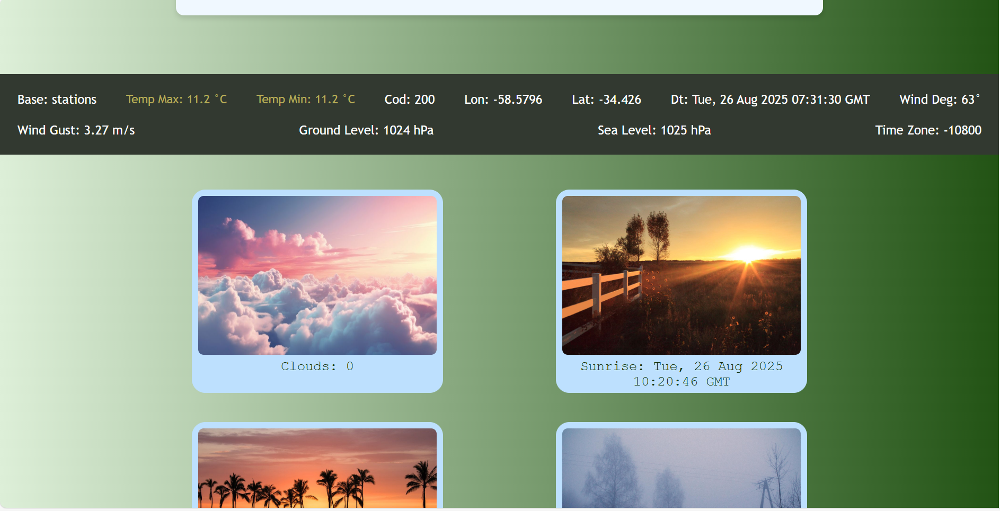

# 🌍 WeatherWise - Your Personalized Weather Companion ☀️

WeatherWise is a dynamic and user-friendly web application built with React, designed to provide you with real-time weather information for cities around the globe and even based on your current location. Whether you're planning a trip, checking the local forecast, or just curious about the weather in another city, WeatherWise has you covered. The application leverages the OpenWeatherMap API to deliver accurate and up-to-date weather data, combined with interactive maps powered by Leaflet to visualize city locations.

## 🚀 Key Features

*   **Global City Search:** Easily search for weather information for any city worldwide.
*   **Real-time Weather Data:** Get current temperature, weather conditions, and other relevant details.
*   **Interactive Maps:** Visualize city locations on an interactive map powered by Leaflet.
*   **Geolocation Support:** Automatically detect your current location and display local weather information.
*   **Infinite Scrolling:** Browse through a vast list of cities with seamless infinite scrolling.
*   **Progressive Web App (PWA):** Install WeatherWise on your device for a native app-like experience.
*   **Responsive Design:** Enjoy a consistent experience across various devices, from desktops to mobile phones.
*   **Social Media Integration:** Share weather updates on LinkedIn and Twitter.

## 🛠️ Tech Stack

*   **Frontend:**
    *   React: JavaScript library for building user interfaces.
    *   React Router DOM: For handling client-side routing.
    *   React Leaflet: React components for Leaflet maps.
    *   React Icons: For using various icons in the application.
    *   React Loader Spinner: For displaying loading animations.
*   **Styling:**
    *   CSS: For styling the components and overall application.
    *   Leaflet CSS: For styling the Leaflet maps.
*   **API:**
    *   OpenWeatherMap API: For fetching weather data and city coordinates.
    *   Public OpenDataSoft API: For fetching city data.
*   **Other:**
    *   JavaScript: The primary programming language.
    *   HTML: For structuring the web pages.
    *   JSON: For data interchange.

## 📦 Getting Started / Setup Instructions

Follow these steps to get WeatherWise up and running on your local machine:

### Prerequisites

*   Node.js (version 16 or higher)
*   npm (Node Package Manager) or yarn

### Installation

1.  Clone the repository:

    ```bash
    git clone <repository_url>
    cd <repository_directory>
    ```

2.  Install the dependencies:

    ```bash
    npm install
    # or
    yarn install
    ```

3.  Obtain an API key from OpenWeatherMap:

    *   Sign up for a free account at [OpenWeatherMap](https://openweathermap.org/).
    *   Get your API key from your account dashboard.

4.  Set up environment variables:

    *   Create a `.env` file in the root directory of the project.
    *   Add your OpenWeatherMap API key to the `.env` file:

        ```
        REACT_APP_OPENWEATHERMAP_API_KEY=YOUR_API_KEY
        ```

### Running Locally

1.  Start the development server:

    ```bash
    npm start
    # or
    yarn start
    ```

2.  Open your browser and navigate to `http://localhost:3000` to view the application.

## 📂 Project Structure

```
weatherwise/
├── public/
│   ├── index.html          # Main HTML template
│   ├── manifest.json       # PWA manifest file
│   └── ...
├── src/
│   ├── App.js              # Main application component
│   ├── index.js            # Entry point of the React application
│   ├── App.css             # Styles for the App component
│   ├── index.css           # Global styles
│   ├── components/
│   │   ├── city/
│   │   │   ├── index.js      # City component (displays weather and map)
│   │   │   └── index.css     # Styles for the City component
│   │   ├── map/
│   │   │   └── index.js      # CityMap component (displays the map)
│   │   ├── home/
│   │   │   ├── index.js      # Home component (city list, search, infinite scroll)
│   │   │   └── index.css     # Styles for the Home component
│   │   ├── geolocation/
│   │   │   ├── index.js      # Geolocation component (user's location weather)
│   │   │   └── index.css     # Styles for the Geolocation component
│   │   └── ...
│   ├── reportWebVitals.js  # Web vitals reporting
│   └── setupTests.js       # Setup for testing
├── .gitignore            # Specifies intentionally untracked files that Git should ignore
├── package.json          # Lists project dependencies and scripts
├── README.md             # Project documentation
└── ...
```

## 📸 Screenshots







## 📬 Contact

If you have any questions or suggestions, feel free to contact me at [daveeddaveedd@gmail.com](mailto:daveeddaveedd@gmail.com).

## 💖 Thanks Message

Thank you for checking out WeatherWise! I hope you find it useful and enjoyable. Your feedback and contributions are greatly appreciated.

